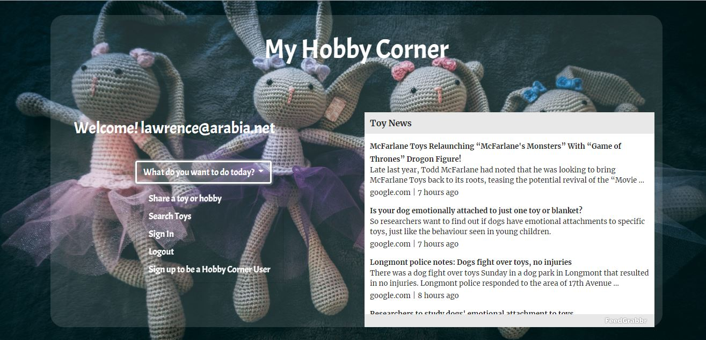
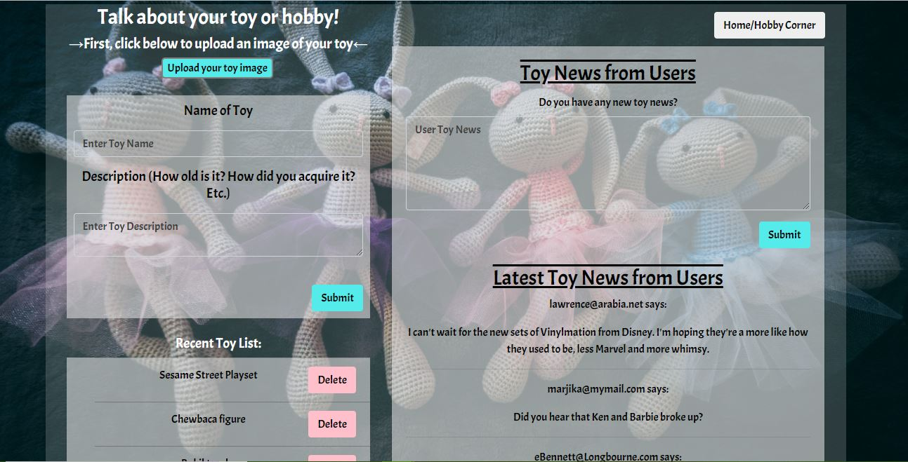
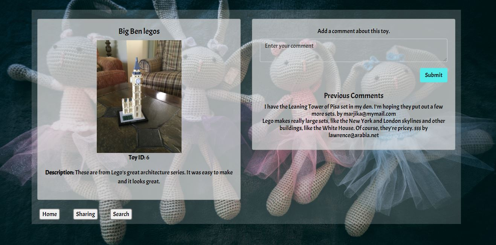
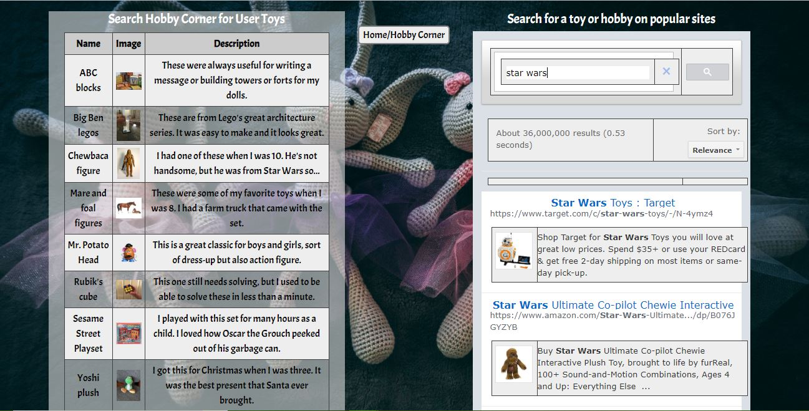

# My Hobby Corner

This project allows you to create a login then sign in and logout to see your account. In the homepage, it has a Toy Newsfeed that will upload daily with the latest news. The main pages uses a dropdown menu to direct the client. If the user is logged in, his or her email appears after the "Welcome" message.

 

You can also share your toy by uploading your toy image and adding the name of the toy and description into it. Once you click submit, it gives you the recent toy list and you can click on the specific toy to see the info. You can add a comment about that toy in the page. Then in the same page you can add "Toy News from you as the user" so others can see commentary about that specific toy.  On the sharing page, both the general comments and recent toys display the most recent at the top.  You may comment on a specific toy whether you're logged in or not, but you must be a logged-in user to make a general toy news comment.  If not logged in, a modal will pop up to remind the client to sign in.

 

In our search toy page, you can see all the toys, in alphabetical order, including info that has been uploaded by the users.  You can also link to the specific toy page by clicking on the toy name.  You can search for a toy on popular sites such as Amazon, ebay, etc. with a Google custom search engine.

