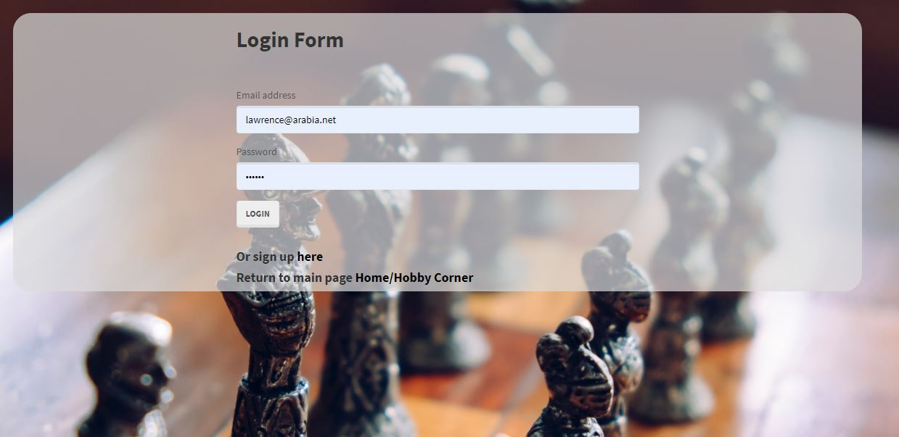

# My Hobby Corner

My Hobby Corner is a site for people who love toys to share their own toys and toy news and comment on others' toys. It is a full Stack application using MVC paradigm, Handlebars templating, Feedgrabbr widget, and more.  The login template was incorporated to save time and for ease of use but was styled to match the theme. The homepage employs a bootstrap dropdown menu and a Toy Newsfeed that will upload daily with the latest toy news. The dropdown menu directs the client to signup, login. logout, share a toy or hobby or search for a toy. If the user is logged in, his or her email appears after the "Welcome" message.

### Login Page

### Main Page

### Sharing and commenting on toys and hobbies and the associated news

You can also share your toy by uploading your toy image and adding the name of the toy and description.  The image handling and storage is aided by Cloudinary. The recent toy list displays the 5 most recently uploaded toys, and you can click on a specific toy to see and add more information. On the sharing page you can also add "Toy News", but you must be a logged-in user to make a general toy news comment.  If not logged in, a modal will pop up to remind you to sign in.  On the toy page, you can add a comment about that specific toy whether you're logged in or not.

### Sharing Page

### Toy id Page

### Search for toys and hobbies

In the search toy page, you can see all the uploaded toys, in alphabetical order.  You can also link to the specific toy page by clicking on the toy name.  You can also search for a toy on popular sites such as Amazon, ebay, etc. with a Google custom search engine.

### About this application

 This repository is for a full stack JavaScript application, employing various technologies, including NPM packages (Express, Express-handlebars, Body Parser, Sequelize, mysql2, Passport, and others), Handlebars templating, database handling, and styling with CSS and Bootstrap.  This project is an update from a project from my bootcamp.  I wanted to improve the look and some of the functionality and redeploy. It is hosted at "https://blooming-peak-73807.herokuapp.com/". This project was created and is maintained by me, Marjika Howarth.